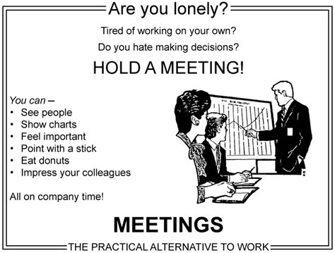
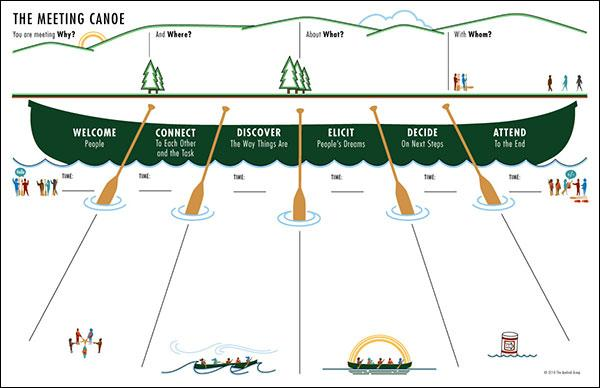
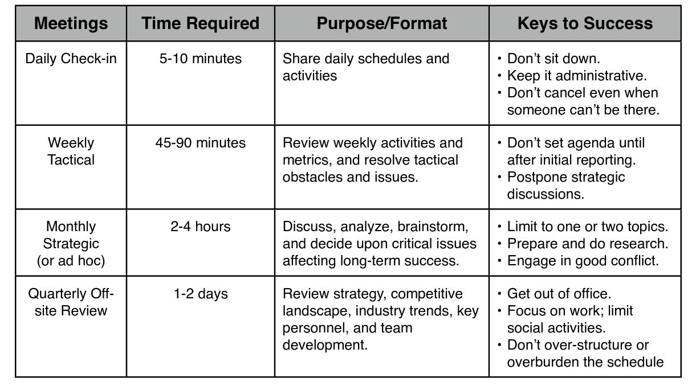
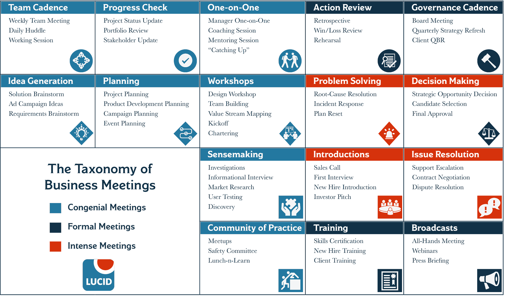
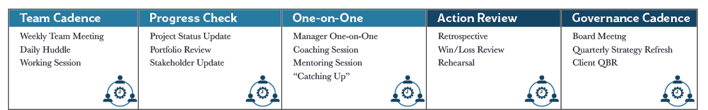
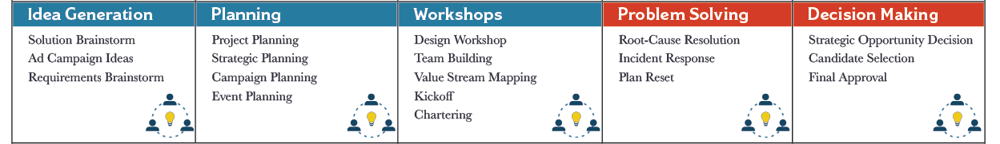
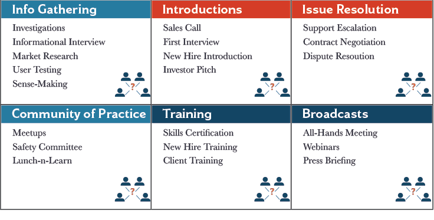

# Meeting Expectations

  Dmytri Kleiner 
  Delivery Lead, [DataChemist](https://terminusdb.com)

  [@dmytri](https://twitter.com/dmytri)

---

Meetings have a bad rep

---

**If you had to identify, in one word, the reason why the human race has not achieved, and never will achieve, its full potential, that word would be “meetings”**

  *Dave Barry Writer and Humorist*

---

**A meeting is an event where minutes are taken and hours wasted**  *– Captain James T. Kirk*

**Meetings are indispensable when you don’t want to do anything**  *– John Kenneth Galbraith*

**The longer the meeting, the less is accomplished** *- Tim Cook*

---

Never doubt that a small group of thoughtful, committed people can change the world. Indeed, it is the only thing that ever has.

  Margaret Mead *Cultural Anthropologist*

---

So how can a committed group change the world? 
# there will be meetings

### How do we make meetings work?

**Elise Keith**, *Where The Action Is*

**Richard & Emily Axelrod**, *Let's Stop Meeting This Way*

**Patrick Lencioni**, *Death By Meeting*

---

### We Meet To
# Create shared perspective
#### Secure alignment and commitment to act
##### Inject energy, enthusiasm, and momentum into our work
> Elise Keith: How to Create a Useful Meeting Flow Model for Your Team

---

# Myth 1
## Everyone hates meetings

#### Reality: They don't 

##### Studies shows that people prefer meetings to other forms of communication

##### People don't hate all meetings

#### They hate bad meetings that waste their time 

> Elise Keith: 3 Myths about Meetings

---

# Myth 2
### Good meetings are short, use an agenda, and result in decisions

#### Reality: Good meetings can be short or long, might have an agenda, and can yield all kinds of useful results besides decisions

#### There are different types of meetings

##### A daily check-in is different than a board meeting

---

# Myth 3
### Meetings are a chronic problem for every organization
##### Reality: People working in organizations that design their meetings don't complain about meetings

##### A sound communication architecture defines the method and frequency of information flow throughout the organization 

#### People feel meeting time was well spent and achieved a useful result

---

### The Basics

1. Schedule meetings at natural transition times
2. Schedule meetings with adequate time to prepare
1. Leave time between meetings for transitions
1. Block full or half days as "No Meetings" time
1. Make meetings optional

> Elise Keith: 5 Tips for Scheduling Meetings That Respect Everyone's Time

---

#### The Basics are Important
# But those are not the real problems

---

## Bad Meeting Behaviour

> Late arrivers, Ramblers, Side Conversationalists, Note Passers,
Multi-taskers, Non-participators, Dominators, Chronic objectors,
Gate-closers, Off-the-wall commenters, Eye rollers, Sighers,
Personal attackers

  Donna Schilder's List

---

## What is the cause of this behaviour?
#### Bad Facilitation, Bad Meeting Design and Bad Communication Architecture
#### It's almost never bad people
##### Bad behaviour is a coping strategy for bad meetings

---

# Psychological Safety
## Silence and Violence
## Fight or Flight

> Crucial Conversations: Tools for Talking When Stakes Are High

---

###### Masking
###### *Selectively showing our true opinions. Sarcasm, sugarcoating, and couching*

###### Avoiding
###### *Steering completely away from sensitive subjects*

###### Withdrawing
###### *Pulling out of a conversation*

###### Controlling
###### *Cutting others off, overstating facts, speaking in absolutes, changing subjects*

###### Labeling
###### *Is putting a label on people or ideas so we can dismiss them*

###### Attacking
###### *Belittling, insulting and threatening*

---

## Why do people behave badly?

- They don't know what the meeting is for
- They are bored
- They don't know what is expected of them
- The don't feel safe
- They are not engaged
- They are not connected to the topic
- They are stressed about other work

---

##### Each meeting needs to be structured such that it's purpose is known, it's not boring, participants know what is expected of them, feel safe, are engaged, are connected to the topic, and not stressed about other work.

---

# Commit to Seeking Mutual Purpose

---

Richard & Emily Axelrod's Meeting Canoe

---

# Invitation Hygiene
#### Why
###### What is the purpose of the meeting?
#### Where
###### Where is it? Location, conference numbers and links
#### What
###### What is expected of participants, is any preparation expected?
#### When
###### When is it? Time Zone?

---

# Check the Tech

**For crying out load**, if you are presenting or facilitating remotely do a technical check!

#### Just ask someone to join a few minutes early to test
--- 
###### I can hear you, can you hear me?
#### Can you see my slides?
##### Can you see me?

---

# The Meeting Canoe
### Ok, let's launch the canoe

---

# Step 1
#### Welcome People

Making participants feel welcome and safe is critical to having a successful meeting

Feeling unsafe or unwelcome will result in disengagement, non-participation and disruptive behaviour

> Attention to each participant, Ice breakers, getting everyone engaged

---

# Step 2
#### Connect to each other and the topic

Get participants talking to each other and engaging with the topic

Build connections between participants so they can work together effectively

> Pair discussions, Circle of questions, 1-2-4-Alls

---

# Step 3
#### Discover the way things are

Present relevant material to the participants

Get the participants to present to the group what information they feel is relevant to the topic

Foster curiosity

> Lighting rounds, Demos, Interviews, Real Time Agenda

---

# Step 4
#### Elicit People's Dreams

Imagine possible outcomes, desired futures, etc

> Futerspectives, Brainstorming, Example mapping

---

# Step 5
#### Decide on next steps

Create a decision making process understood by everyone

Involve everyone

> Value Slicing, Event Storming, Backlog refinement

---

# Step 6
#### Attend to the end

Review what has been done, what has been decided, and what the next steps are

> Walk the walls, Retrospective, Backlog review

---

The focus on and amount of time spent on each step in the Meeting Canoe will vary greatly depending on who is meeting and what the meeting is for

---

### Communication Architecture

- What types of meetings do we need?
- Who should be there?
- What should their outcomes be?
- How often do we need to have them?
- How should each be structured and facilitated?
- How can we best use email, chat, and other tools?

---

#### Types of meetings: Lencioni's Model

<a href="https://www.teachmeteamwork.com/files/meeting_model.pdf">https://www.teachmeteamwork.com/files/meeting_model.pdf</a>

---

#### The main cause of bad meetings and bad meeting behaviour is swiss-army-knife meetings which don't have a clear meeting type and desired outcome

##### Lencioni's 4 types is a good basis for a lot of teams, because it clarifies each meeting's purpose
### But wait, there's more...

---

> Elise Keith goes beyond **Check In, Tactical, Strategic and Review,** and identifies 16 distinct types of meetings

The more precisely you can identify the meeting types you are planning, the better you can invite the right people, ensure you have enough time and use the correct structure to make the meeting effective

---

> Elise Keith: 16 Meeting Types

---

# Cadence

What are we doing?

Known Participants, Known Work. 

---

# Catalyst

What should we be doing?

Diversity of perspective, Customers, Stakeholders, Doers

---

# Explore

Share, Learn, Evaluate, Understand and Influence

---

## Conflict and Context

#### Meetings need conflict
##### People should feel comfortable disagreeing
###### Varying opinions and perspectives must be welcome

#### Meetings need context
##### Meetings are not effective when they lack context
###### Meetings should not be a mix of random ingredients
##### Clarity around what topics are relevant is needed

> Patrick Lencioni: Death By Meeting

---

# Brain Friendly
#### Make your meetings brain friendly to drive engagement and help everyone think and learn

> Sharon Bowman: Six Trumps, The Brain Science That Makes Training Stick

---
##### Movement trumps sitting
###### Sitting for extended lengths of time  makes  thinking  and  learning  more difficult 
##### Talking trumps listening
###### Insert discussions among participants
##### Images trump words
###### Use pictures, stories, and metaphors
##### Writing trumps reading
###### People remember that they write longer than what they hear
##### Shorter trumps longer
###### Dividing presentations into shorter segments
##### Different trumps same
###### Change things regularly

---

## Disagree and commit
#### Once discussions have happened, and decisions have been made, everybody must commit to them
##### Everyone should know that we will meet again to review decisions, refine and change them as needed as part of our communication architecture

---

# Prime Directive
#### Regardless of what we discover, we understand and truly believe that everyone did the best job they could, given what they knew at the time, their skills and abilities, the resources available, and the situation at hand.

> Norm Kerth, Project Retrospectives: A Handbook for Team Review
---

### Mastering Meetings

- Design an effective communication architecture by understanding what meeting types your organization needs and at what frequency
- Run successful meetings by using effective meeting structures that are participant focused and engaging
- Engage in healthy conflict, disagree and commit
- Improve and adjust continuously

---

fin.

